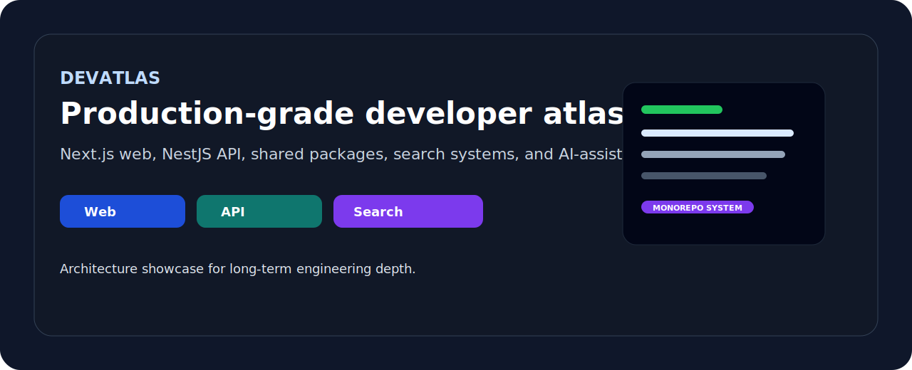

# DevAtlas Platform

<p align="center">
  
</p>

DevAtlas یک monorepo مبتنی بر `pnpm` و `turbo` برای یک پلتفرم محتوای فنی است. وضعیت فعلی پروژه روی دو اپ عملیاتی و چند پکیج مشترک متمرکز است:

- `@devatlas/web` — فرانت‌اند عمومی با Next.js 16 و React 19
- `@devatlas/api` — API مبتنی بر NestJS 11 و Drizzle ORM
- `packages/*` — پکیج‌های مشترک برای `types`، `ui`، `utils`، `config`، `content` و `api-client`

## Workspace Snapshot

```text
devatlas/
  apps/
    api/
    web/
  packages/
    api-client/
    config/
    content/
    types/
    ui/
    utils/
  docs/
  scripts/
```

## Tech Stack

### Web

- Next.js 16.2.3
- React 19.2.4
- Tailwind CSS 3.4.17
- Vitest 3

### API

- NestJS 11.1.x
- Drizzle ORM 0.45.x
- PostgreSQL 15+
- class-validator + class-transformer
- Swagger

### Tooling

- pnpm 10.33.0
- Turborepo 2.9.x
- TypeScript 5.9.x
- ESLint 9.39.x
- Vitest 3.2.x

## Active Runtime Surface

### API

- Base prefix: `/api`
- Versioning: URI versioning with default `v1`
- Swagger: `/docs`
- Modules: `health`, `guides`, `tools`, `categories`, `tags`, `search`, `content-relations`, `ai`, `database`

### Web

- Routes:
  - `/`
  - `/guides`
  - `/guides/[slug]`
  - `/tools`
  - `/tools/[slug]`
- Guide and tool detail pages render related-content suggestions and persisted AI summaries from the API layer.

## Quick Start

### Prerequisites

- Node.js 20+
- pnpm 10+
- PostgreSQL 15+

### Install

```bash
pnpm install
cp .env.example .env
```

### Run locally

```bash
pnpm dev
```

Or per app:

```bash
pnpm dev:api
pnpm dev:web
```

### Docker Compose

```bash
docker compose -f infra/docker/docker-compose.yml up --build
```

## Common Commands

```bash
pnpm lint:api
pnpm lint:web
pnpm test:api
pnpm test:web
pnpm typecheck:api
pnpm typecheck:web
pnpm verify:api
pnpm verify:web
pnpm doctor
pnpm health
pnpm agent:autopilot
pnpm agent:ops
pnpm agent:smart
pnpm agent:auto:offline
pnpm agent:auto
pnpm agent:preflight
pnpm agent:tools
pnpm agent:vps
pnpm agent:local:chat
pnpm agent:deepseek:local --file package.json --json
pnpm agent:offline:install
```

- `pnpm verify:api` now includes `db:check` before lint/typecheck/test so schema drift is caught earlier.
- `pnpm agent:smart` is the adaptive daily loop: local quality checks + optional smoke/deepseek
- `pnpm agent:auto:offline` is safe when there is no internet access (no remote APIs, no DeepSeek calls).
- `pnpm agent:deepseek:local` runs code review against the local offline model instead of the hosted DeepSeek API.
- `pnpm agent:offline:install` installs user services and timers for local offline AI automation.

Quick mode map:
```bash
# local-only (default for token- and bandwidth-saving mode)
pnpm agent:auto:offline
# first, run a combined readiness pass and follow output
pnpm agent:preflight --json

# connected mode with review (if DEEPSEEK_API_KEY is present)
pnpm agent:auto --deepseek --deepseek-diff HEAD~1..HEAD
```

## Notes

- `apps/api` uses Drizzle schemas under `apps/api/src/db/schema`.
- local env template lives in `.env.example` and uses `NEXT_PUBLIC_API_BASE_URL` for the web app.
- Global API responses are normalized through `TransformInterceptor` and `HttpExceptionFilter`.
- The repo contains helper scripts under `scripts/`, including `agent:context`, `agent:verify`, `doctor`, and `health`.
- Shared package imports should always use workspace package names, not internal `src/` paths.

## Docs

- `docs/ROADMAP.md`
- `docs/ARCHITECTURE.md`
- `docs/API-CONTRACE.md`
- `docs/STANDARDS.md`
- `docs/SCRIPTS.md`
- `docs/AGENT_GUIDE.md`
- `docs/CONTINUATION_PLAYBOOK.md`
- `docs/OFFLINE_AI.md`
